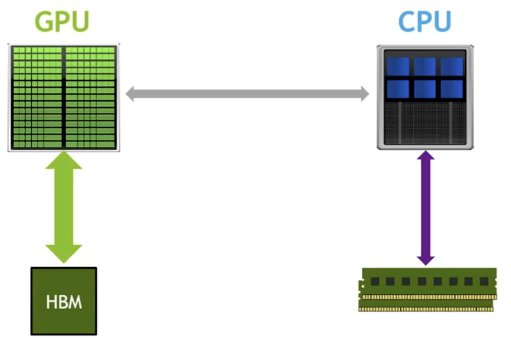
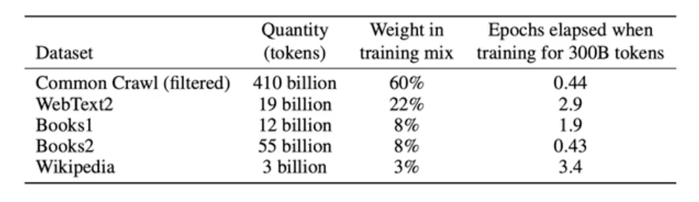
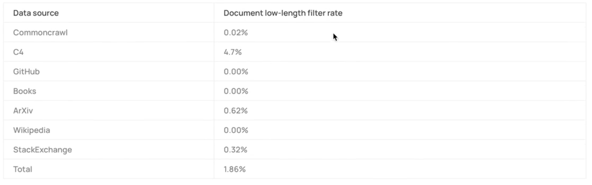

# Building GPT2

## play.ipynb-S1
### 加载hf的gpt2模型，查看模型参数结构和位置编码的分布情况。

### 使用hf的pipeline生成文本。

## train_gpt2.py
### 从头构建GPT2骨架，匹配hf的参数结构，实现可以加载hf预训练权重的GPT2模型。

#### 先创建 class GPT2和config
依照stdict创建ModuleDict和ModuleList。

#### 创建Block、CausalSelfAttention、MLP等模块。

#### 定义from_pretrained方法复制hf预训练权重。

#### 引入tiktokenizer，完成文本的编码和解码。

#### 实现文本生成逻辑，使用top-k采样生成文本，与hf的pipeline生成的文本进行对比。

#### play.ipynb-S2 里使用自己实现的文本生成逻辑进行文本生成，与自定义的train_gpt2.py里生成的文本对比，说明模型权重加载正确。

## train_gpt2_v2.py
### 从随机初始化权重开始训练GPT2模型。
play.ipynb-S3 里下载tinyshakespeare数据集，tiktoken编码，构造数据x，y

train_gpt2_v2.py里实现get batch

进行前向得到logits

计算交叉熵损失

设置优化器，实现训练循环

设置dataloader，进行多轮epoch训练

### 设置权重共享，实现transformer.wte和lm_head共享权重

### 设置权重初始化，保持和GPT2官方实现一致，方差为0.02，均值为0，bias为0，使用正态分布初始化线性层和嵌入层的权重

### play.ipynb-S4 里实验残差流中标准差的增长问题，理解为什么要对残差流进行缩放。

### 在train_gpt2_v2.py里实现对残差流进行缩放的初始化。
对会被加到残差上的两个输出投影层（attn.c_proj 和 mlp.c_proj）用更小的初始化标准差 0.02 / sqrt(2*n_layer)，以抵消深层残差累积带来的尺度膨胀，使训练更稳定。

## train_gpt2_v3.py
用time计时，注意要用torch.cuda.synchronize()确保时间测量准确。

### 加速训练速度，充分利用硬件
pytorch 默认使用的是float32精度。

GPT参数：计算速度，显存，内存带宽，计算精度（fp32、tf32、fp16、bf16）


大部分计算发生在线性层和注意力机制中的矩阵乘法运算。

使用tf32，float16或bfloat16精度可以加速这些计算，同时减少显存占用。

#### 原始
time: 521.91 ms, tokens/sec: 15696.18

#### 使用TF32加速训练
在train_gpt2_v3.py里添加torch.set_float32_matmul_precision('high')启用TF32加速矩阵乘法计算。

time: 399.66 ms, tokens/sec: 20497.36

观察到速度提升1.5倍不如官方说明，因为虽然底层计算在 Tensor Core 上以 TF32 执行，但仅仅是在计算时裁剪了精度，但算子语义仍为 float32，且并非所有 FP32 算子都会被映射到 Tensor Core，同时整体性能还受限于显存带宽与内存访问开销

#### 使用bf16加速训练
混合精度训练（Mixed Precision Training）是一种在训练深度学习模型时同时使用多种数值精度（如float32和bfloat16）的方法。在混合精度训练中，模型的某些部分使用较低精度（如bfloat16）进行计算，以加快训练速度和减少显存占用，而其他部分仍然使用较高精度（如float32）以保持数值稳定性和模型性能。

在train_gpt2_v3.py里使用torch.autocast(device_type=device, dtype=torch.bfloat16)上下文管理器启用bf16加速训练。
也可以model.to(torch.bfloat16)将模型参数转换为bfloat16精度。
区别是：使用autocast时，只有在上下文管理器内的计算会使用bfloat16精度，而model.to(torch.bfloat16)会将整个模型的参数都转换为bfloat16精度。

time: 293.91 ms, tokens/sec: 27872.07

#### 使用torch.compile编译模型以加速训练

在train_gpt2_v3.py里使用model = torch.compile(model)编译模型

Torch Compile 是 PyTorch 提供的一种将 PyTorch 模型编译为更高效执行形式的工具。通过编译，Torch Compile 可以优化模型的计算图，从而提高训练和推理的速度。它通过静态分析模型的计算图，应用各种优化技术（如操作融合、内存优化等），减少耗时IO。

time: 176.42 ms, tokens/sec: 46435.84


#### Memory Hierarchy with Bandwidth & Memory Size
GPU SRAM SRAM: 19 TB/s （20 MB）
GPU HBM HBM: 1.5 TB/s （40 GB）
Main Memory（CPU DRAM）DRAM:12.8 GB/s （>1tB）

#### flash attention
Flash Attention 是一种高效的注意力机制实现，旨在减少内存使用和提高计算速度。它通过重新组织注意力计算的顺序，减少中间结果的存储需求，从而实现更快的计算。

time: 139.74 ms, tokens/sec: 58622.16

#### 修改丑陋的数字
model = GPT(GPTConfig(vocab_size=50304))

增加了计算量，但是加速了

time: 136.06 ms, tokens/sec: 60210.21

## train_gpt2_v4.py
#### 设置Adam优化器的betas参数为(0.9, 0.95) 匹配gpt3论文中的设置，有助于训练稳定性。

#### 裁剪全局梯度范数到1.0，防止梯度爆炸
在训练过程中，梯度爆炸可能导致模型参数更新过大，从而使训练

#### 实现学习率调度器，采用线性预热和余弦退火相结合的方式
在训练的前10个步骤中，学习率从0线性增加到最大值3e-4，然后在接下来的40个步骤中，学习率按照余弦函数逐渐减小到最小值3e-5。

#### 设置model.configure_optimizers()方法，设置权重衰减只应用于权重矩阵，不应用于偏置项和LayerNorm的参数。
权重衰减原理：
权重衰减（Weight Decay）是一种正则化技术，通过在损失函数中添加一个与模型权重相关的惩罚项，来防止模型过拟合。它通过鼓励模型权重保持较小的值，从而提高模型的泛化能力。

#### 设置AdamW的fused=True以加速优化器计算。

#### suizhe 模型大小变大，lr下降，batchsize变大

#### 要按照GPT3论文的超参数设置，batchsize=50万（tokens），需要对应设置B=488，T=1024,但是显存不足

#### 使用梯度累积（Gradient Accumulation）来模拟更大的batch size。
通过在多个微步（micro-steps）中累积梯度，然后再进行一次参数更新，从而实现更大的有效batch size，而不需要额外的显存。
在train_gpt2_v4.py里实现梯度累积：
计算总batchsize=524288tokens，B=8，T=1024，每个微步的batchsize=8*1024=8192tokens，需要累积64个微步后进行一次参数更新。
1. 设置grad_accum_steps参数，表示每次参数更新前累积的微步数。
2. 在每个微步中，计算损失并进行反向传播，但不进行参数更新。
3. 每当累积了grad_accum_steps个微步后，进行一次参数更新，并清零梯度。

## train_gpt2_v5.py
#### 分布式数据并行训练（DDP）
设置分布式数据并行训练（Distributed Data Parallel, DDP）以利用多GPU进行训练，加速训练过程。
### 最开始初始化分布式参数，然后使用DDP包装模型。

### 数据并行加载数据，修改dataloader，根据rank和world_size分配数据，使每个GPU处理不同的数据子集。

### 训练循环里，设置梯度同步，只在最后一个微步进行梯度同步以提高效率。    
```    
    if ddp:
        model.require_backward_grad_sync = (micro_step == grad_accum_steps - 1)
    loss.backward()
```

### 在计算和打印损失时，进行跨进程的损失聚合。
```
    if ddp:
        dist.all_reduce(loss_accum, op=dist.ReduceOp.SUM)

```

time: 4189.89 ms, tokens/sec: 125131.77

### configure_optimizers()要基于raw_model，而不是DDP包装后的model。

### 在训练循环中，确保只有主进程打印日志和保存模型，避免重复操作。

## train_gpt2_v6.py 用于在更大数据集上训练GPT2模型。
### 数据集
gpt2使用闭源webtext，从reddit的外链中爬取的高质量网页文本数据集，40GB文本数据。
开源的openwebtext数据集是webtext的替代品

gpt3使用commoncrawl数据集，包含从互联网上爬取的数TB文本数据。还有webtext2、books1、books2、wikipedia等数据集。


不错的数据集还有：
SlimPajama: A 627B token, Cleaned and deduplicated version of RedRajama


FineWeb: decanting the web for the finest text data at scale
大小: 15Trillion tokens

## train_gpt2_v6.py 用fine-web-edu 10B数据集训练GPT2模型

### fineweb.py 
从 FineWeb-Edu 读取文本数据

用 GPT-2 tokenizer 分词，每篇文档前加 <|endoftext|>

多进程并行分词

将所有 token 顺序拼接

每 1e8 tokens 切成一个 shard

第一个 shard 作为 val，其余作为 train

每个 shard 以 uint16 的 .npy 文件保存到磁盘

### 修改dataloader，支持从多个shard加载数据

### 添加dataloader.reset()方法，重置数据加载器状态

### 添加val_loader用于验证集评估

### 添加验证集评估逻辑，每隔一定步数在验证集上评估模型性能，计算并打印验证损失。

### 把最后之前停用的生成移动到前面，添加生成文本示例逻辑，每隔一定步数生成文本示例，展示模型的生成能力。

### hellaswag 评估
HellaSwag 是一个用于评估机器阅读理解和常识推理能力的数据集。它包含多个选择题，每个题目由一个上下文和四个选项
HellaSwag 是一种基于对抗筛选构建的常识推理多项选择基准，能够在模型能力早期阶段对情境连贯性与常识理解的获得提供高灵敏度、平滑的评估信号。

下载 HellaSwag 验证集，把每题的“上下文+4个候选结尾”分别分词成 4 条序列，用 GPT-2 只在结尾部分计算负对数似然（cross-entropy loss），选择 loss 最小的结尾作为预测，并统计准确率（acc 用总 loss，acc_norm 用按长度归一的平均 loss）。

## train_gpt2.py
### 添加log_dir和log_file参数，设置日志目录和日志文件路径。
### 修改验证集评估逻辑，每隔2000步在验证集上评估hellaswag，计算并打印验证损失，并将结果写入日志文件。
### 添加模型检查点保存逻辑，每隔2000步保存一次模型检查点。